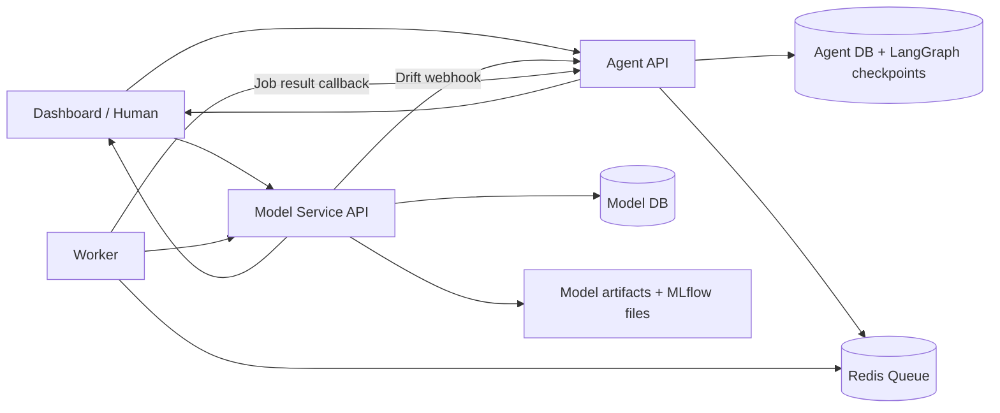

# Drift Triage Co-pilot

Drift Triage Co-pilot is a small MLOps system that watches a machine learning model after deployment, detects drift, opens an investigation when the model starts seeing unusual data, and keeps a human in control before any risky Production action happens.

The main idea is simple: the system can monitor, explain, and prepare actions, but it should not blindly retrain, rollback, or promote a Production model without checks and approval.

---

## Project folders

```txt
project-5-drift-triage/
├── contracts/        # Shared API contracts between services
├── model_service/    # FastAPI model serving, prediction logging, drift detection, promotion checks
├── agent/            # FastAPI investigation agent, approvals, queue creation, LangGraph flow
├── worker/           # Redis worker for replay, retrain, and rollback jobs
└── dashboard/        # Streamlit dashboard for humans to monitor and approve actions
```

---

## High-level architecture



---

## Main system flow

### 1. Model serving flow

The `model_service` loads the trained model artifacts from `model_service/artifacts/`. When `/predict` is called, it validates the input using the saved schema, applies the same preprocessing used during training, returns the probability and class prediction, and saves the prediction record to the database.

### 2. Drift detection flow

The `model_service` compares recent prediction/input data against the saved training reference statistics in `reference_stats.json`. It calculates drift scores, assigns a severity such as `normal`, `warning`, or `critical`, stores the result, and sends a webhook to the `agent` only when the drift severity changes.

### 3. Investigation flow

The `agent` receives the drift webhook at `/webhooks/drift`. It validates the contract, stores the drift event, opens an investigation, and runs the LangGraph-style investigation flow:

```txt
webhook received
    ↓
supervisor
    ↓
triage
    ↓
action decision
    ↓
approval check
    ↓
communication summary
    ↓
completion / waiting state
```

### 4. Safe action flow

The agent decides what should happen next:

| Drift state | Typical decision | Human approval? | Queue job? |
|---|---|---:|---:|
| `insufficient_data` | monitor | No | No |
| `normal` | monitor or resolve | No | No |
| `warning` | run replay test | No | Yes |
| `critical` | retrain or rollback | Yes | After approval |
| Production promotion | promote only after checklist | Yes | No direct worker job |

### 5. Worker flow

The `worker` listens to the Redis queue. It executes slow or risky actions outside the API request cycle. It supports replay tests, retraining, and rollback jobs. After the job finishes, it sends the result back to the agent so the investigation and dashboard can update.

### 6. Dashboard flow

The `dashboard` is the human control layer. It shows health, drift state, investigations, pending approvals, queue/jobs, registry info, promotion checklist results, and demo controls. The human can approve or reject actions from the dashboard.

---

## Important safety rule

Production is not changed automatically.

The project separates detection from action:

```txt
Detect drift → Investigate → Explain → Ask for approval → Run safe action
```

This means the model service can detect a problem, and the agent can recommend an action, but Production-level actions must pass human approval and/or a programmatic checklist.

---

## Main endpoints

### Model service

| Method | Endpoint | Purpose |
|---|---|---|
| `GET` | `/health` | Check service and model loading status |
| `POST` | `/predict` | Run prediction and save prediction record |
| `GET` | `/registry` | Show loaded model metadata and artifacts |
| `GET` | `/drift` | Run or return drift analysis |
| `GET` | `/replay-fixture` | Return saved replay fixture |
| `GET` | `/replay-fixture/compare` | Compare current predictions against replay fixture |
| `GET` | `/promotion/checklist` | Run Production promotion checklist |
| `POST` | `/promotion/production` | Request Production promotion after approval |
| `POST` | `/rollback/production` | Record local Production rollback decision |

### Agent

| Method | Endpoint | Purpose |
|---|---|---|
| `GET` | `/health` | Check database and Redis connectivity |
| `POST` | `/webhooks/drift` | Receive drift event from model service |
| `GET` | `/investigations` | List investigations |
| `GET` | `/investigations/{id}` | Read one investigation |
| `GET` | `/investigations/{id}/summary` | Read investigation with messages, jobs, approvals |
| `GET` | `/approvals/pending` | List pending human approvals |
| `POST` | `/approvals/{id}/approve` | Approve an action |
| `POST` | `/approvals/{id}/reject` | Reject an action |
| `GET` | `/queue/status` | Show Redis queue and tracked jobs |
| `GET` | `/queue/jobs` | List jobs |
| `POST` | `/queue/jobs/result` | Receive job result from worker |

---

## Run locally with uv

Run these commands from separate terminals.

### 1. Train or refresh artifacts

```bash
cd model_service
uv sync
uv run python train.py
```

### 2. Start the model service

```bash
cd model_service
uv sync
uv run uvicorn app.main:app --reload --port 8000
```

### 3. Start the agent

```bash
cd agent
uv sync
uv run uvicorn app.main:app --reload --port 8010
```

### 4. Start the worker

```bash
cd worker
uv sync
uv run python -m app.main
```

### 5. Start the dashboard

```bash
cd dashboard
uv sync
uv run streamlit run dashboard.py --server.port 8501
```

Then open:

```txt
http://localhost:8501
```

---

## Expected local ports

| Service | Default URL |
|---|---|
| Model service | `http://127.0.0.1:8000` |
| Agent | `http://127.0.0.1:8010` |
| Dashboard | `http://127.0.0.1:8501` |
| Redis | `redis://localhost:6379/0` |

---

## Environment configuration

Each service reads environment variables from the project `.env` file using its own prefix.

| Service | Prefix examples |
|---|---|
| Model service | `MODEL_SERVICE_DATABASE_URL`, `MODEL_SERVICE_AGENT_DRIFT_WEBHOOK_URL`, `MODEL_SERVICE_ARTIFACT_DIR` |
| Agent | `AGENT_DATABASE_URL`, `AGENT_REDIS_URL`, `AGENT_MODEL_SERVICE_URL` |
| Worker | `WORKER_DATABASE_URL`, `WORKER_REDIS_URL`, `WORKER_AGENT_URL`, `WORKER_MODEL_SERVICE_URL` |
| Dashboard | `AGENT_API_URL`, `MODEL_SERVICE_API_URL`, `DASHBOARD_REQUEST_TIMEOUT_SECONDS` |

---

## Demo flow

A good presentation flow is:

1. Open the dashboard overview.
2. Show the current model registry and promotion checklist.
3. Trigger a warning or critical drift event from Demo Controls.
4. Show the new investigation.
5. Show the approval or queue state.
6. Approve the action if needed.
7. Show the worker job result and investigation update.

This demonstrates the full idea of safe automation: the system detects drift, explains the issue, asks for human approval when needed, and then executes the approved action through the queue.
